# Quizzes

[](https://packagist.org/packages/himedia/quizzes)

Plate-forme de quizzes à choix multiples (QCM) avec interface d'analyse des résultats.

## Description

### Deux zones

  * L'une publique pour choisir un questionnaire, le dérouler et obtenir score et statistiques.
  * L'autre avec mot de passe pour accéder aux sessions passées, à leur score et statistiques et à leur correction détaillée.

### Questionnaires

La plate-forme de quizzes permet :

  * d'héberger et proposer de multiples questionnaires,
  * de proposer des sessions mélangeant plusieurs questionnaires,
  * de réaliser des sessions ne portant que sur une partie des questions d'un ou plusieurs questionnaires, questions tirées aléatoirement,
  * une grande facilité d'ajout de questionnaires, coloration syntaxique des bouts de code pouvant émailler les questions et propositions de réponse.

Dans un questionnaire :

  * chaque question appartient à un thème afin de faciliter l'analyse des réponses, mais cette information ne transparaît pas forcément dans l'énoncé des questions (un seul thème est retenu par question par souci de simplicité),
  * thèmes, questions et propositions arrivent dans un ordre différent à chaque session,
  * le temps restant est affiché constamment,
  * pas moyen de revenir sur une question précédente (page précédente sans effet),
  * le barème est optimal lorsque toute question admet au moins une bonne proposition et au moins une mauvaise proposition.

### Barème

Le barème favorise l'absence de réponse à la mauvaise réponse.
**Il vaut mieux s'abstenir lorsque l'on n'est pas sûr de soi.**

Ainsi de manière générale, si une question possède `P` propositions de réponse, alors :

  * chaque question nécessite de cocher `1` à `P-1` cases et rapporte de `-1` à `1` point, `0` si non répondue. 
  * si une question requiert `N` cases cochées pour la bonne réponse, alors : 
     * chaque case bien cochée rapporte `1/N` point, 
     * chaque case mal cochée enlève `1/(P-N)` point.
     
**Il en découle que les trois stratégies suivantes aboutissent à un score nul :**
  * cocher toutes les cases, 
  * n'en cocher aucune
  * et statistiquement cocher au hasard `1` à `P-1` cases.
  
## Installation et configuration

### Git clone

Cloner dans le répertoire de votre choix, *par ex.* `/var/www/quizzes` (le répertoire doit être vide) :

```bash
$ git clone git@github.com:Hi-Media/Quizzes.git /var/www/quizzes
```

### Dépendences

#### Composer

La plupart des dépendences sont gérées par [composer](http://getcomposer.org). 
Lancer l'une des commandes suivantes :

```bash
$ composer install
# or
$ php composer.phar install
```

Au besoin, pour installer composer localement, lancer l'une des commandes suivantes :

```bash
$ curl -sS https://getcomposer.org/installer | php
# or
$ wget --no-check-certificate -q -O- https://getcomposer.org/installer | php
```

Lire <http://getcomposer.org/doc/00-intro.md#installation-nix> pour plus d'informations.

#### Mailing

L'envoi de mail exploite [mutt](http://www.mutt.org/).

### Configuration

#### Apache 2

Les *rewrite rules* sont nécessaires.
Un fichier `.htaccess` se trouve dans `/www` pour rediriger les URLs sur `/web/index.php`.
Au besoin :

```bash
$ sudo a2enmod rewrite
```

Exemple de *virtual host* :

```bash
$ cat /etc/apache2/sites-enabled/quizzes.xyz.com 
<Directory /var/www/quizzes/web>
    Options -Indexes
    AllowOverride FileInfo
    Order allow,deny
    allow from all
</Directory>

<VirtualHost *:80>
    ServerName    quizzes.xyz.com
    ServerAlias    quizzes
    ServerAdmin    admin@xyz.com
    RewriteEngine    On
    DocumentRoot    /var/www/quizzes/web

    ErrorLog    /var/log/apache2/quizzes-error.log
    CustomLog    /var/log/apache2/quizzes-access.log combined
    LogLevel warn
</VirtualHost>
```

#### Application
Initialiser le fichier de configuration en dupliquant `conf/qcm-dist.php` et en l'adaptant :

```bash
$ cp '/var/www/quizzes/conf/qcm-dist.php' '/var/www/quizzes/conf/qcm.php'
```

Pour mettre à jour des comptes d'administration modifier la clé `'admin_accounts'`, tableau au format `login => md5(password)`.

#### Mise à jour des questionnaires

Les questionnaires sont cryptés sur le serveur web.

Lors d'une mise à jour des questionnaires exécuter le script `/src/encrypt.php` afin de régénérer 
les `/resources/quizzes/*.php` à partir des `/resources/quizzes/src/*.php`.
Le répertoire `/resources/quizzes/src` n'est alors plus nécessaire.

## Captures d'écran

### Déroulement d'une session

Choix de la session :

[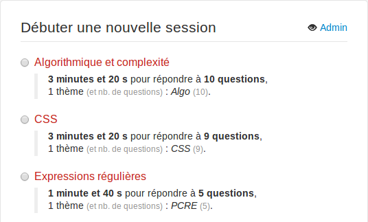](doc/images/choix_session2.png)

Un questionnaire peut être la réunion de plusieurs questionnaires ou une partie d'un autre questionnaire :

[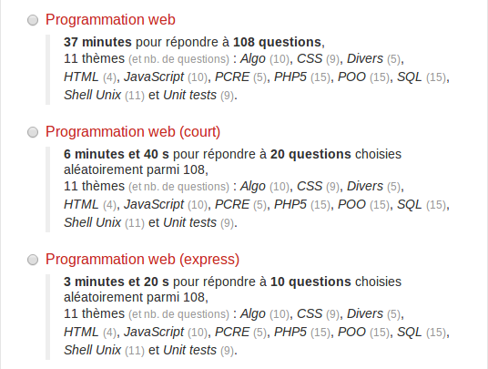](doc/images/choix_session1.png)

Identification du candidat :

[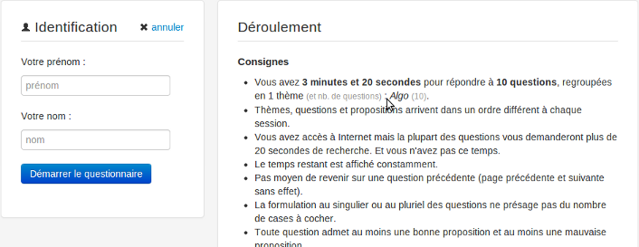](doc/images/identification.png)

Exemple d'affichage d'une question :

[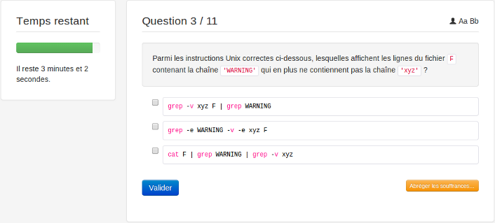](doc/images/question.png)

### Analyse

Accueil de la section d'administration avec liste des sessions passées et en cours :

[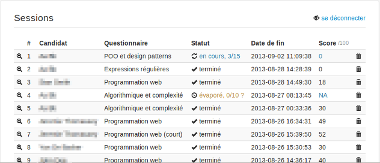](doc/images/listing_sessions.png)

Résultat général d'une session :

[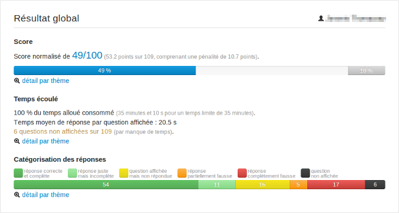](doc/images/resultat_global.png)

Score par thème avec visualisation de la quantité de points perdus par pénalités :

[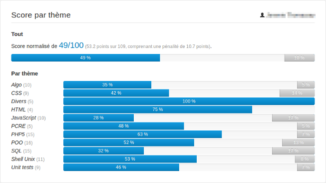](doc/images/score_par_theme.png)

Temps moyen de réponse par thème :

[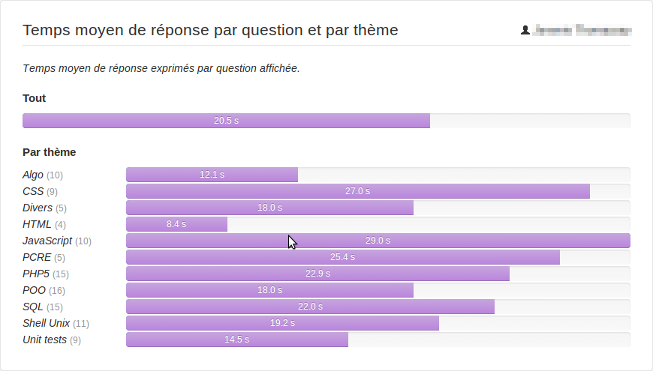](doc/images/temps_par_theme.png)

Catégorisation des réponses par thème :

[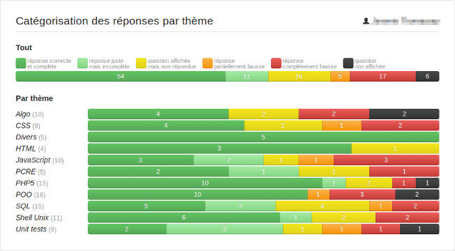](doc/images/categorisation_par_theme.png)

Correction d'une question, accessible seulement à partir de la zone privée :

[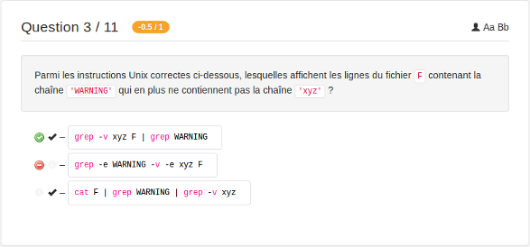](doc/images/correction_question.png)

Configuration d'un questionnaire, dans `/resources/quizzes/src` :

[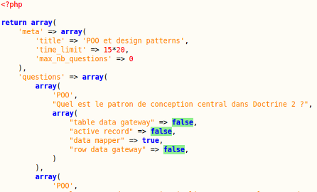](doc/images/questionnaire_config.png)

## Copyrights & licensing

Licensed under the GNU General Public License v3 (GPL-3.0+).
See [LICENSE](LICENSE) file for details.
